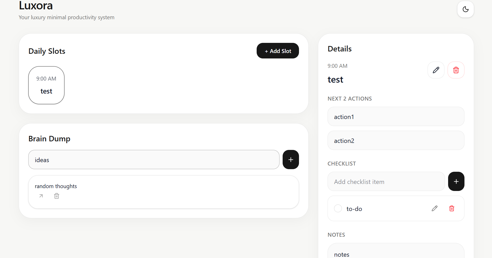
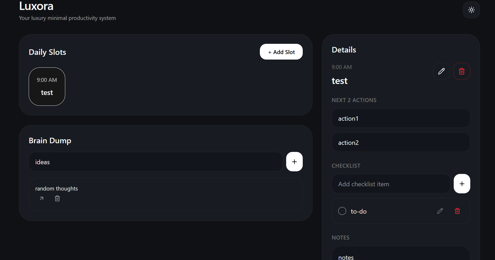
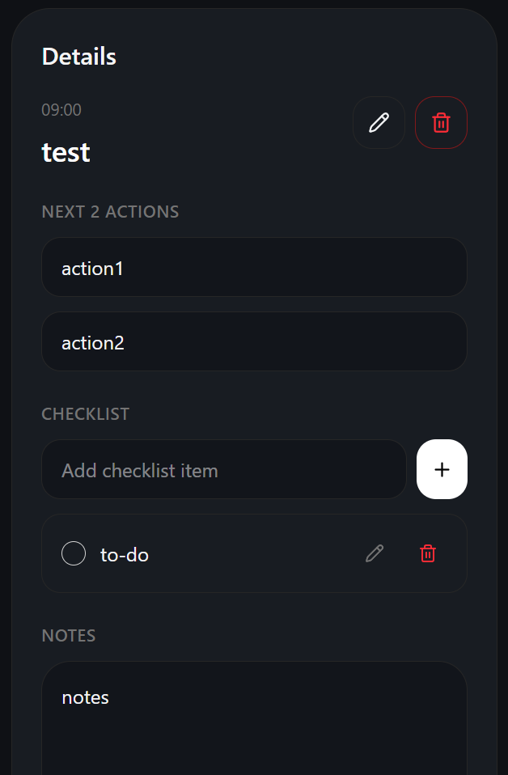
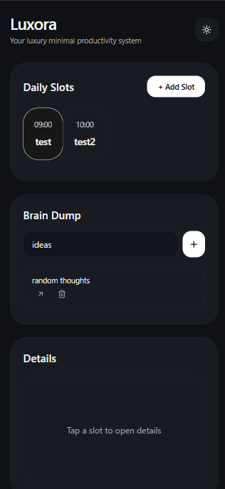
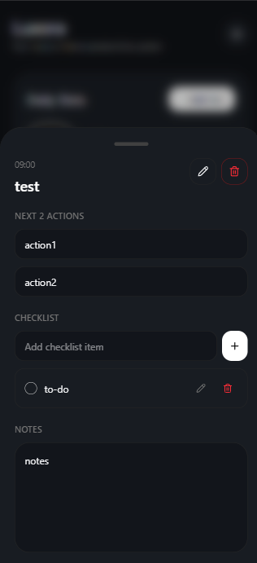

# Luxora

A personal productivity dashboard built with **React, FastAPI, PostgreSQL, and Docker**.

Luxora helps users organize their day through structured time slots, actionable planning, quick thought capture, and persistent task management. It is designed as the foundation for future analytics, intelligent insights, machine learning features, and eventually agent-driven productivity workflows.

---

## Project Overview

Modern productivity tools often separate planning, notes, tasks, and reminders into different applications.

Luxora brings these workflows together in a single system:

* Plan your day using time-based slots
* Define next actions for every task
* Capture thoughts instantly using Brain Dump
* Track progress through checklists
* Store notes directly within each slot
* Persist everything using PostgreSQL

The long-term vision is to evolve Luxora into an intelligent productivity platform capable of generating insights, recommendations, and autonomous planning assistance.

---

## Screenshots

### Dashboard



---

### Dark Mode



---

### Slot Details



---

### Mobile View





---

## Features

### Daily Slot Planning

* Create time-based slots
* Edit slot title and schedule
* Delete slots
* Persistent storage

### Next Actions

Each slot supports:

* Next Action 1
* Next Action 2

Designed to encourage action-oriented planning rather than passive task lists.

### Notes

Each slot includes a dedicated notes section.

Features:

* Persistent storage
* Instant updates
* Refresh-safe synchronization

### Checklist Management

For every slot:

* Create checklist items
* Edit checklist items
* Toggle completion state
* Delete checklist items

All checklist data is stored in PostgreSQL.

### Brain Dump

Capture thoughts quickly before organizing them.

Features:

* Add thoughts
* Delete thoughts
* Convert thoughts into slots

### Workspace Persistence

Luxora uses a workspace-based persistence model.

Features:

* No authentication required
* Browser-specific workspace generation
* Persistent user data
* PostgreSQL-backed storage

---

## Tech Stack

### Frontend

* React
* TypeScript
* Vite
* TailwindCSS
* Zustand
* Framer Motion
* Lucide Icons

### Backend

* FastAPI
* SQLAlchemy
* Pydantic

### Database

* PostgreSQL

### Infrastructure

* Docker
* Docker Compose

---

## Architecture

### Backend Architecture

Route
→ Service
→ Model
→ PostgreSQL

### Frontend Architecture

API Layer
→ Zustand Store
→ Components
→ User Interface

### Current Database Models

#### Workspace

* id
* workspace_hash
* created_at

#### Slot

* id
* workspace_id
* title
* time
* next_action_1
* next_action_2
* notes

#### ChecklistItem

* id
* slot_id
* text
* completed

#### BrainDump

* id
* workspace_id
* text

---

## Project Structure

```text
Luxora/
├── backend/
│   ├── app/
│   │   ├── api/
│   │   ├── core/
│   │   ├── db/
│   │   ├── models/
│   │   ├── schemas/
│   │   └── services/
│   ├── requirements.txt
│   └── docker-compose.yml
│
├── frontend/
│   ├── src/
│   │   ├── api/
│   │   ├── components/
│   │   ├── hooks/
│   │   ├── pages/
│   │   └── store/
│   └── package.json
│
└── README.md
```

---

## Local Setup

### Clone Repository

```bash
git clone <your-repository-url>
cd Luxora
```

### Start PostgreSQL

```bash
cd backend

docker compose up -d
```

### Backend Setup

```bash
cd backend

python -m venv .venv

source .venv/bin/activate
# Windows:
# .venv\Scripts\activate

pip install -r requirements.txt

uvicorn app.main:app --reload
```

Backend runs at:

```text
http://127.0.0.1:8000
```

---

### Frontend Setup

```bash
cd frontend

pnpm install

pnpm dev
```

Frontend runs at:

```text
http://127.0.0.1:5173
```

---

## Author

Satya Sundar

Computer Science & Engineering Student at KIIT University
